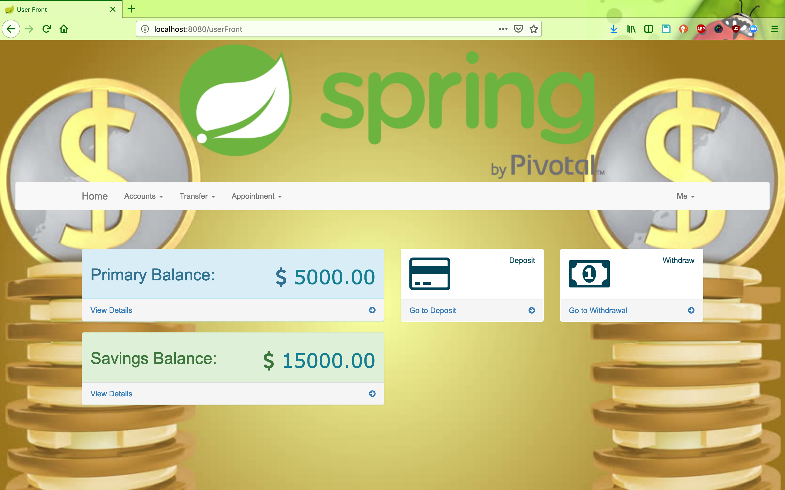

# EBANK-FULLSTACK
Application de gestion de compte bancaires avec Spring Boot et Angular
---------------------------------------------------------------------------
Java, Java EE, Spring Boot
Angular, TypeScript
----------------------------------------------------------------------------
git clone 

BACK-END | mvn clean install | mvn spring-boot:run |
FRONT-END |

## Screen shot 

### Sign Up Page

### Sign In Page

### Dashboard Page

### Deposit Page

### Dashboard Page   
